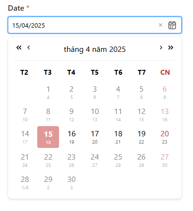
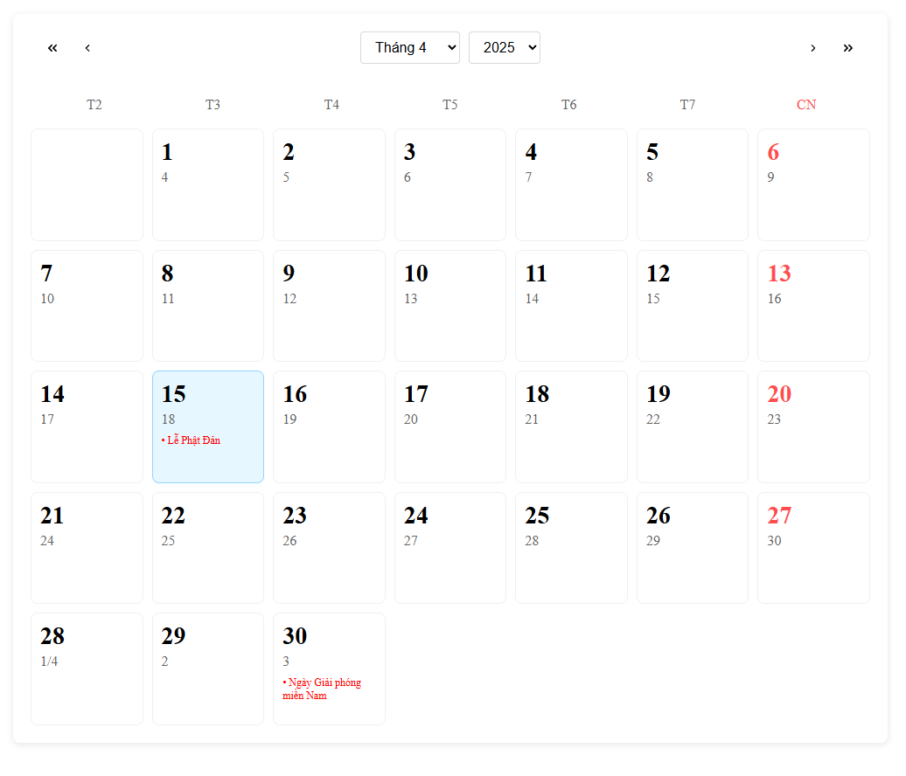

# Lunar Date Calendar Component

A React component library for displaying and selecting dates with both solar (Gregorian) and lunar calendar support, specifically designed for Vietnamese lunar calendar calculations.

## Preview

### I, Lunar Date picker




### II, Lunar Date calendar




## Features
-   Display both solar and lunar dates
-   Support for Vietnamese holidays and events
-   Customizable date selection
-   Responsive calendar grid layout
-   Support for date range restrictions
-   Event indicators for special dates
-   Localization support

## Usage example 
```jsx
    import '@phungvansyhb/vietnamese-lunar-date-picker/dist/styles.css';
    import { 
    LunarDatePicker,
    LunarCalendar,
    VietNameseEvents,
    LunarDate,
    SolarDate } 
    from '@phungvansyhb/vietnamese-lunar-date-picker';

    function App() {
        console.log(VietNameseEvents)
        console.log('lunar date', new SolarDate(new Date()).toLunarDate())
        return (
            <>
                <div style={{ width: '360px'}}>
                    <LunarDatePicker />
                </div>
                <div style={{ width: '1000px' }}>
                        <LunarCalendar />
                </div>
            
            </>
        );
    }

    export default App;
```


## Props

### I, Lunar date picker props

| Prop | Type | Default | Description |
|------|------|---------|-------------|
| value | Date | undefined | Selected date |
| onChange | (date: Date) => void | undefined | Callback when date is selected |
| valueFormat | string | 'DD/MM/YYYY' | Format of the displayed date value |
| label | string | 'Date' | Label text for the input field |
| inputName | string | 'date' | Name attribute for the input field |
| required | boolean | true | Whether the input is required |
| calendarIcon | ReactNode | <CalendarIcon /> | Custom calendar icon component |
| showLunarDate | boolean | true | Show lunar date |
| lunarFormat | 'name' \| 'number' | 'number' | Format of lunar date display |
| localeOptions | Intl.DateTimeFormatOptions | { weekday: 'narrow', month: 'long', year: 'numeric' } | Date format options |
| showToday | boolean | true | Highlight today's date |
| locale | string | 'vi' | Locale for date formatting |
| maxDate | Date | undefined | Maximum selectable date |
| minDate | Date | undefined | Minimum selectable date |

### II, Lunar Calendar props 

| Prop | Type | Default | Description |
|------|------|---------|-------------|
| value | Date | undefined | Selected date |
| onChange | (date: Date) => void | undefined | Callback when date is selected |
| showLunarDate | boolean | true | Show lunar date |
| lunarFormat | 'name' \| 'number' | 'number' | Format of lunar date display |
| localeOptions | Intl.DateTimeFormatOptions | { weekday: 'narrow', month: 'long', year: 'numeric' } | Date format options |
| showToday | boolean | true | Highlight today's date |
| locale | string | 'vi' | Locale for date formatting |
| maxDate | Date | undefined | Maximum selectable date |
| minDate | Date | undefined | Minimum selectable date |
| events | { type: 'anually' \| 'once', date: Date, content: string, isLunar: boolean }[] | VietNameseEvents | Array of events to display on calendar |


## Dependencies

- React
- dayjs
- @nghiavuive/lunar_date_vi

## License

MIT
